# 西部世界VPN全测评，电脑梯子使用感受分享
西部世界VPN测评,westword梯子好用吗,便宜的梯子推荐,付费梯子推荐,高性价比梯子软件,免费好用的VPN分享,2022好用稳定的电脑梯子,V2ray节点/Trojan节点/ssr节点分享

**西部世界VPN，也称Westworld梯子，之前经常看到网友在网上探讨，作为一个资深的梯子使用者，无论是电脑梯子还是手机梯子，都有长年的使用经历，因此也是忍不住想要试试这个梯子是不是如传说中那么好用。**

特别鸣谢：
网友‘封沙一壶酒’提供的西部世界VPN年费账号。

**声明：本次测评没有收取任何广告费，所有测评结果出自我本人的网络以及电脑环境，具有一定主观性，仅供参考。**

## 一、官网以及节点

西部世界官网地址：[https://xbsj3462.fun/i/th014](https://xbsj3462.fun/i/th014)

之前已经听说过，西部世界是由欧盟的一家公司开发运营，进入他们的官网，确实也是支持中英双语版本切换，官网主页面还是比较清爽用心的，不像是套壳的脚本小子。

---
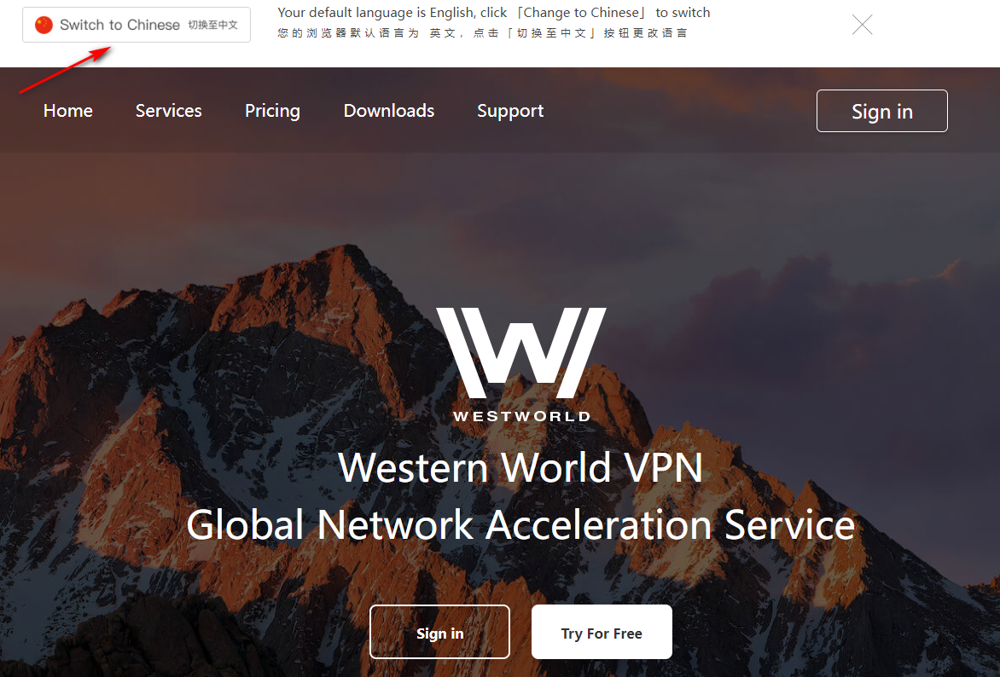
---

点击【sign in】就能进入VPN的账号注册界面，这一点应该没什么好说的。

---
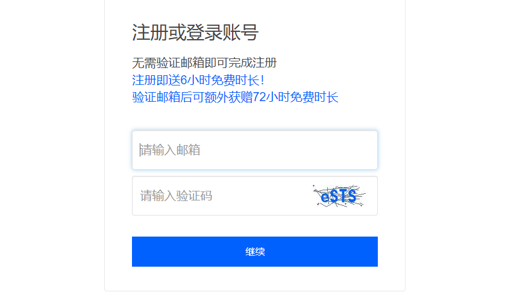
---
在注册阶段，我发现了一个很有意思的事情，大家看上面的提示，西部世界支持【真实邮箱】以及【非真实邮箱】注册，也就是说你可以用自己的邮箱去注册，也可以随便编写一个邮箱注册，即使这个邮箱不存在，也能注册成功。

区别在于，随意填写的邮箱，注册后只有六小时的免费试用梯子的时间，而真实邮箱因为可以接收邮箱验证码，验证成功后能有三天免费使用时间。

到这一步我直接停住了，去试了下心中的一个猜想，如果这个猜想成功，甚至可以让西部世界VPN成为一个永久免费使用的梯子。

**步骤如下：**

首先，我去google搜索“临时邮箱”，选择其中一个，获取到了临时邮箱的邮箱号。

---
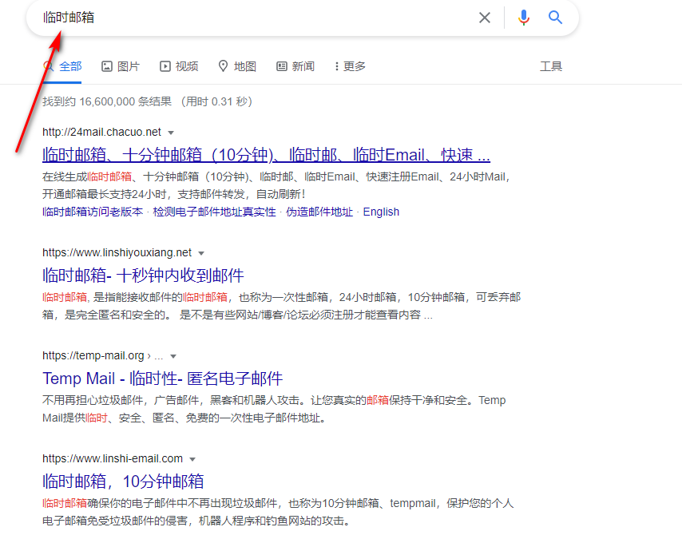
---
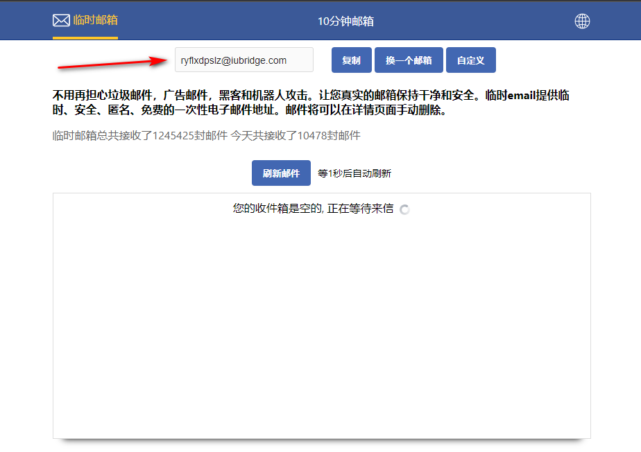
---
然后我将该邮箱账号填入**西部世界VPN**的网站进行注册，然后发现，居然真的收到了验证码，并且成功解锁三天的免费使用权限。

---
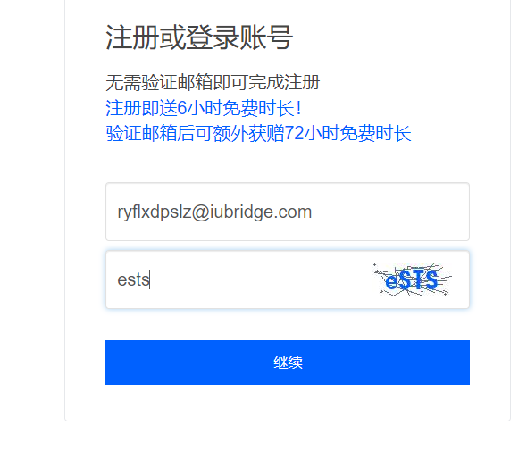
---
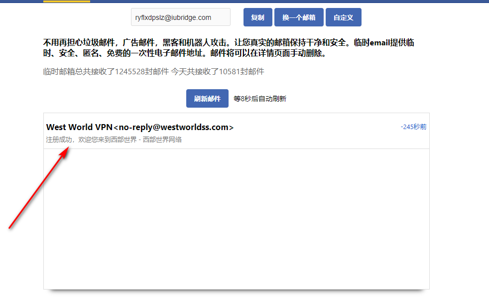
---
这就有趣了，要知道临时邮箱是可以无限获取无限更换的，这代表免费使用的时间，就可以无限叠加无限延长，光这一点就能**免费使用西部世界VPN了**，唯一有点遗憾的是，针对免费试用的账户，西部世界只开放了三条试用节点，但经过测试，这三条试用节点的速度，也远超大部分机场了。

---

---
## 二、西部世界电脑梯子的客户端分类以及节点概况

进入网站后，我仔细观察了西部世界的客户端以及所有节点，发现这个梯子软件无论是客户端完善度，还是节点的丰富性，都做到了极大程度的合理分配。

拿其客户端举例，目前后台支持的客户端有：

**PC端：windows/Mac/Linux
手机端：ios/Andriod**

涵盖了目前市面上的所有主流系统，不管你是使用台式电脑还是笔记又或者是苹果和安卓手机，甚至是服务器系统，西部世界VPN都能提供相应的客户端下载，拿windows系统的电脑客户端和安卓客户端试了下，安装过程也很简单，下载后双击运行，就能安装成功，不需要任何复杂的插件。

---
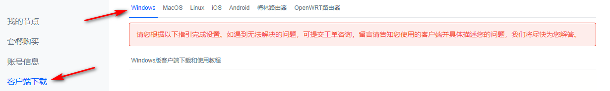
---
关于西部世界电脑梯子的节点，给我感觉安排也很合理，全站有108条节点，其中商务节点18条，游戏节点8条，剩下的全部都是IEPL直连节点，西部世界能上IEPL线路着实是给了我一个比较大的惊喜和意外，因为像这类超优质的线路，采购成本非常高，一般机场根本不会放给用户使用。

---
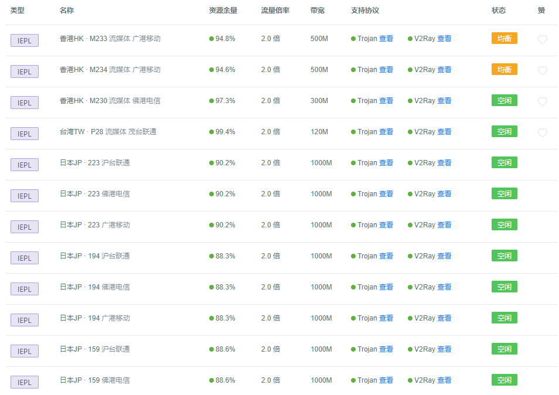
---

---
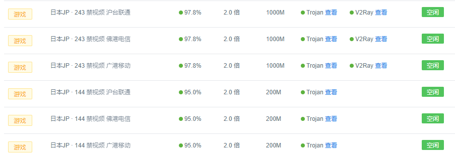
---
Westworld梯子后台的节点类型和节点丰富度，在我这里算是过关了，质量很不错（动用了IEPL专线，质量不可能差）。

## 三、西部世界VPN的测速

接下来就是大家最关心的网速问题，也是我自己比较关心的，先说一下我自己的网络环境给大家参考。

**网络环境：**

宽带：移动100M

系统：windows 10 

测速时间：早八点/晚九点

测速平台：SpeedTest/Youtube

**测试一：**

时间：早8：00

线路：香港HK · M234 流媒体 广港移动

平台：SpeedTest

---
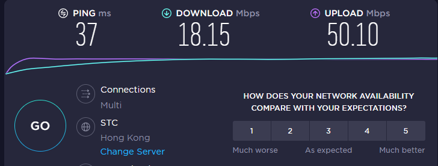
---
**测试二：**

时间：晚9：00

线路：香港HK · M234 流媒体 广港移动

平台：SpeedTest

---
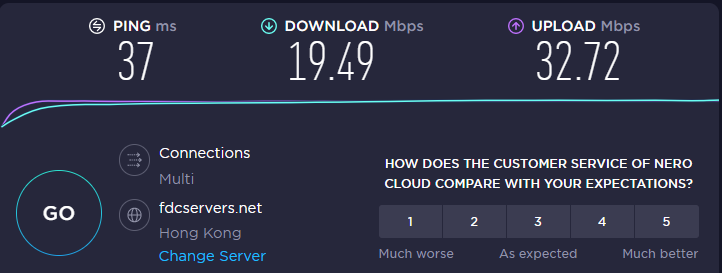
---
**测试三：**

时间：早8：00

线路：香港HK · M234 流媒体 广港移动

平台：Youtube

---

---
**测试四：**

时间：晚9：00

线路：香港HK · M234 流媒体 广港移动

平台：Youtube

---
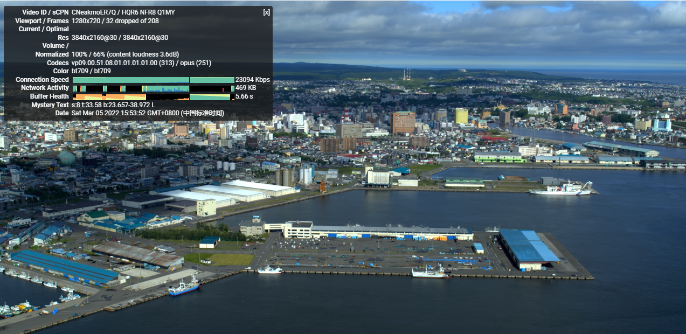
---
以上测速结果我是单独针对一条节点进行测试，当然我也挑选了其他节点测试过，日本，美国，加拿大等等节点，包括商务和流媒体节点，测速结果都很理想。

## 四、套餐以及价格

就如我最开始所说，西部世界电脑梯子给用户提供三天的免费试用时间，三天时间过后，是要收费的（不想付费的小伙伴，可以根据我开头测试的那个方法，用临时邮箱永久使用他们的免费节点），付费节点可以观看Netflix以及Hulu。

我看了下他们的收费价格，是以时间和流量标准计费，具体如下：

---
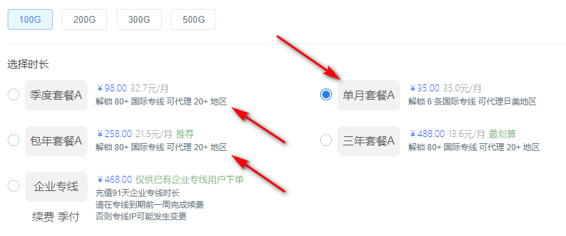
---
我自己考虑了下，其中包年套餐A是性价比很高的，毕竟这个价格能够用上IEPL专线，不说血赚，也是非常理想了，但是对于刚刚接触梯子的用户，我还是建议从包月入手，降低试错成本，老手可以随意。

最后说一点自己的想法，**西部世界梯子**对于新手老手而言，我感觉都是比较友好的，尤其是线路配置，在诸多电脑和手机梯子软件当中可以称得上是优秀，如果你有长期使用一款**稳定梯子软件**来**科学上网**的打算，大可以考虑下这家。

